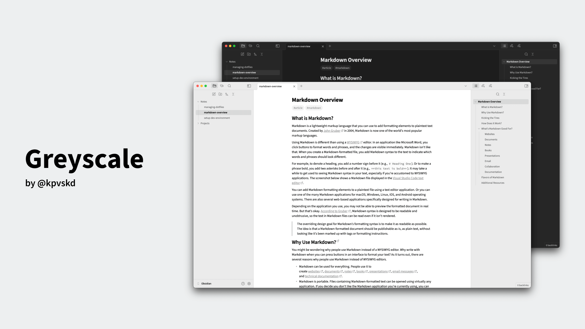
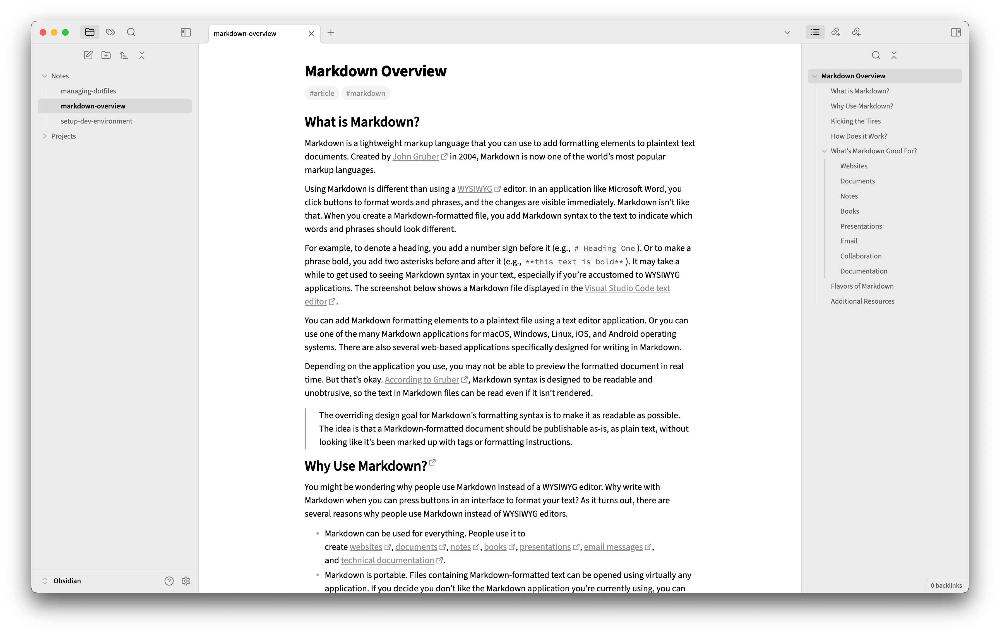
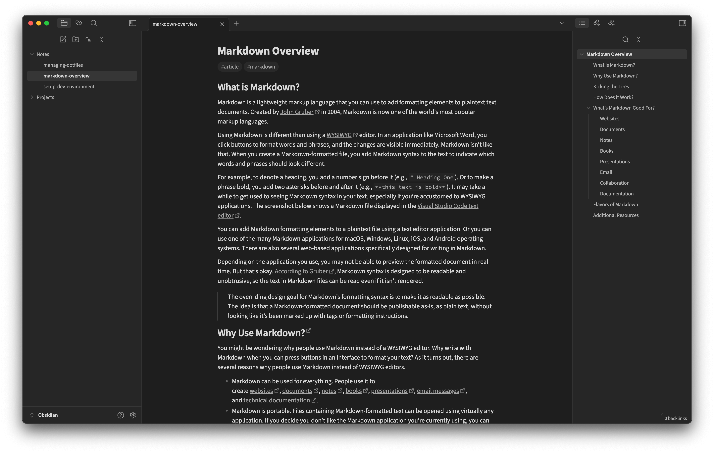

# Greyscale

## Table of Contents
- [About](#about)
- [Screenshots](#screenshots)
- [Typography](#typography)

## About
A simple and elegant greyscale theme for Obsidian.

## Screenshots
Light mode:

Dark mode:

## Typography
Fonts in use:
- [Source Sans 3](https://adobe-fonts.github.io/source-sans/)
- [Source Code Pro](https://adobe-fonts.github.io/source-code-pro/)
